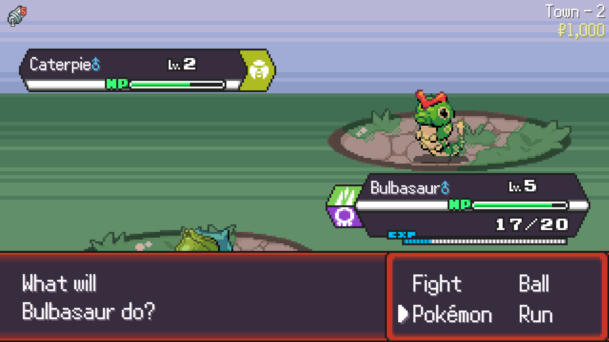

# PokéRogue Move Descriptions
Tamper/greasemonkey extension for PokéRogue that allows you to see move descriptions while holding the stats key *(default: shift)* during move select.

## Installation

1. Install Tampermonkey ([chrome](https://chromewebstore.google.com/detail/tampermonkey/dhdgffkkebhmkfjojejmpbldmpobfkfo)/[firefox](https://addons.mozilla.org/en-GB/firefox/addon/tampermonkey/)) OR Greasemonkey ([firefox](https://addons.mozilla.org/en-GB/firefox/addon/greasemonkey/))
2. Open the raw version of the above `script.user.js` file ([link](https://github.com/KeiranY/pokerogue-movedescriptions/raw/main/script.user.js))
3. Click install

## Usage

Once in battle in PokéRogue, pressing shift will display the move description text. This text would normally only be accessible by selecting Pokemon > Summary > Moves.

